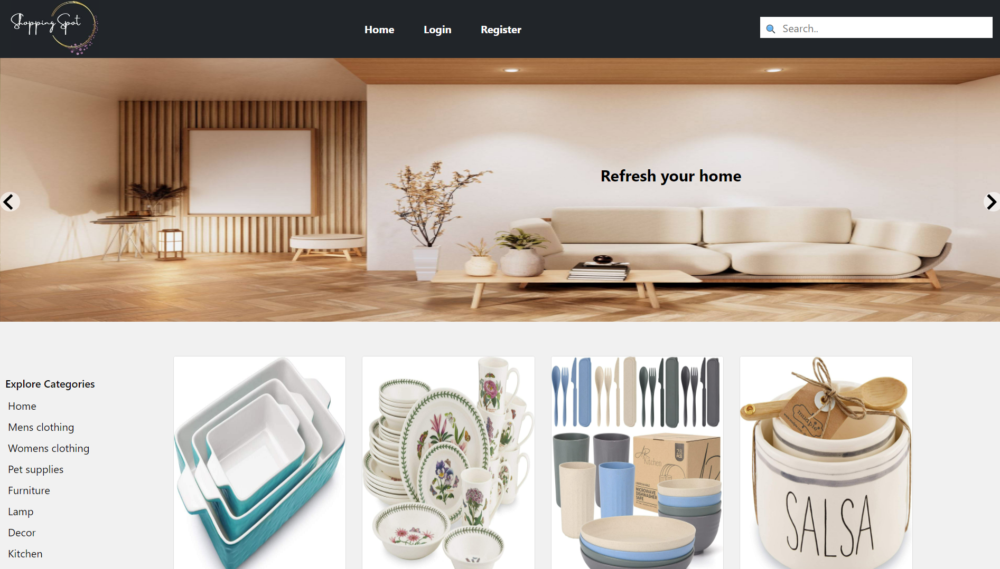
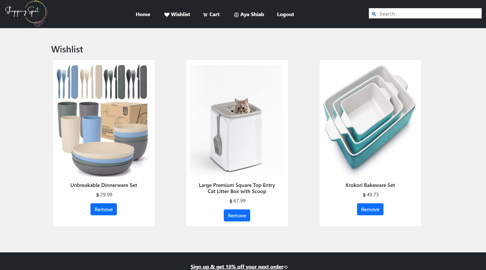
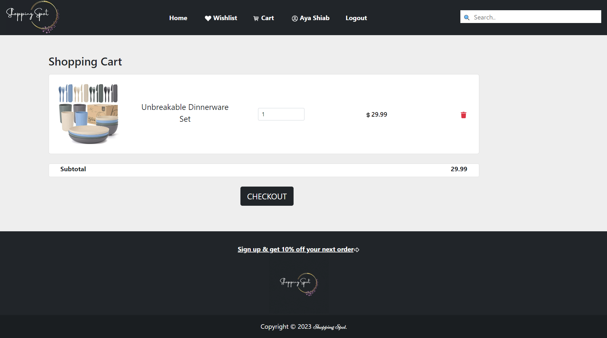
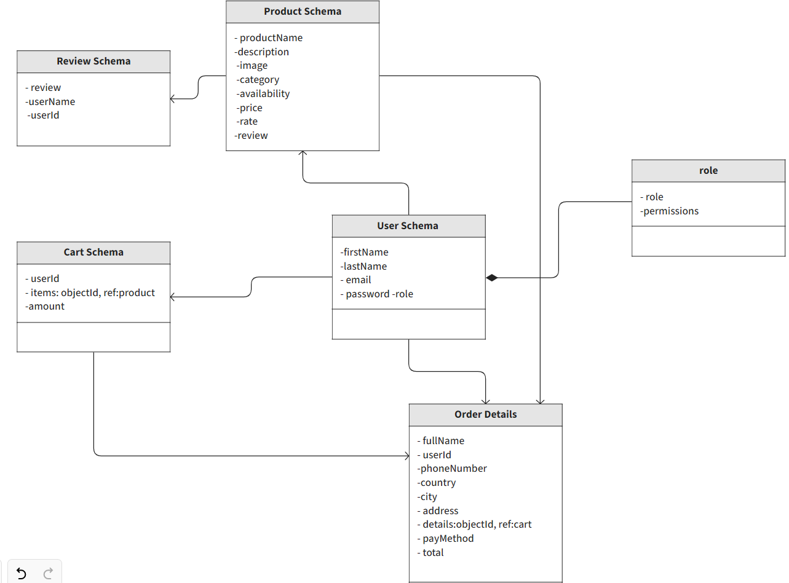

<p align="center">
<a href="https://www.meraki-academy.org" target="_blank" rel="noopener noreferrer">
 
 </a>
</p>

<h3 align="center">Shopping Spot
</h3>

---

<p align="center"> 
A simple full-stack e-commerce application built with Mongodb, Express, React, Nodejs.
  
</p>

## 📝 Table of Contents

- [About](#about)
- [Getting Started](#getting_started)
- [Usage](#usage)
- [Built Using](#built_using)
- [User Story](#user_story)
- [Data Flow](#data_flow)
- [Guided By](#guided_by)

## 🧐 About <a name = "about"></a>

Are you looking for a quick and easy way to browse and buy products via a trusted website? The shopping spot is the application you are looking for.

Shopping spot is an e-commerce app that aims to provide different types of products at the same place and facilitate the product purchase process. It allows you to view various products with the best prices, browse their images, descriptions, and customer reviews, and choose products of interest. Products can be added to your wishlist or your shopping cart. Also, the shopping spot application provides a user-friendly design to ensure the best user experience.

## 🏁 Getting Started <a name = "getting_started"></a>

These instructions will get you a copy of the project up and running on your local machine for development and testing purposes.

### Prerequisites

- Visual Studio Code follow this <a href='https://code.visualstudio.com/download'>link</a> to install.
- Git Bash follow this <a href='https://git-scm.com/downloads'>link</a> to install.
- Node.js follow this <a href='https://nodejs.org/en/download'>link</a> to install.
- MongoDB follow this <a href='https://www.mongodb.com/try/download/community'>link</a> to install.

### Installing:

1. Clone the repo to your local machine using git bash.

```
git clone https://github.com/C7-AyaShiab/MERAKI_Academy_Project_4
```

2. Install packeges repeat this step in backend and frontend folder

```
npm i
```

3. Run server using git bash inside backend folder

```
npm run dev
```

4. Run application using git bash inside frontend folder

```
npm run start
```

Now app ready to use

The home page of the application will be

## 🎈 Usage <a name="usage"></a>

- Visitors can search, view product details, and read customer reviews.
- Only registered users can add products to their wishlist, add their reviews of products, add items to the cart, and check out those items using the available payment methods (cash or credit) to provide the greatest convenience for the user. 
- Users can register immediately with their Google account.
- To view the home page, click on the **Home** tab provided in the navigation bar.
- To view your wishlist, click on the **Wishlist** tab provided in the navigation bar.



- To view your shopping cart, click on the **Cart** tab provided in the navigation bar.



- To add product to your wishlist, click on the :black_heart: button.
- To add product to your shopping cart, click on the :shopping_cart: button.

## ⛏️ Built Using <a name = "built_using"></a>

- [MongoDB](https://www.mongodb.com/) - Database
- [Express JS](https://expressjs.com/) - Server Framework
- [React JS](https://https://reactjs.org/) - Web Framework
- [Node JS](https://nodejs.org/en/) - Server Environment

## User Story <a name = "#user_story"></a>

Your trello board link
<a href='https://trello.com/b/tIn4aYzD/project-4'>Trello</a>

## Data Flow <a name = "#data_flow"></a>

</a>

## ⚠️ Guided By <a name = "guided_by"></a>

This project is guided by ©️ **[MERAKI Academy](https://www.meraki-academy.org)**
